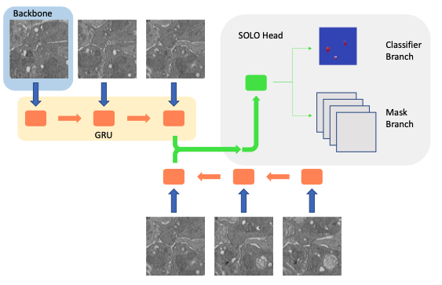
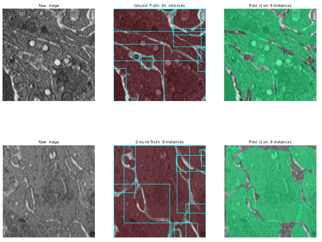
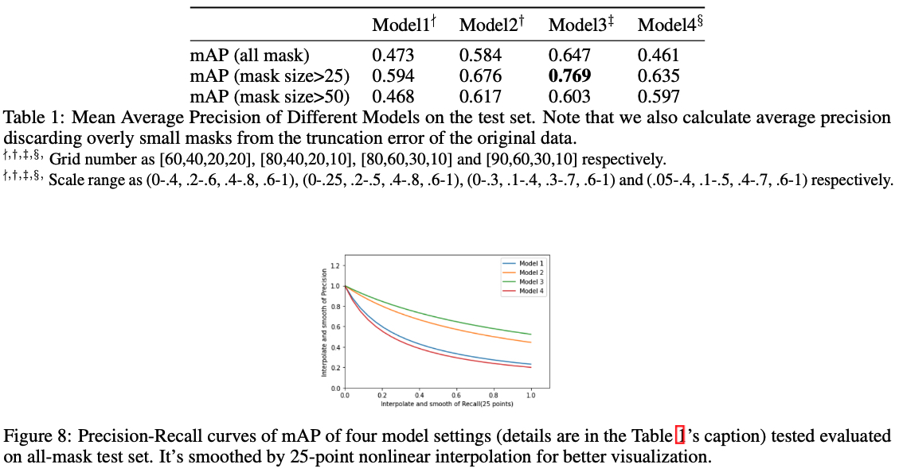

# CV Project: SOLO and GRU for Hemostatic Plug Segmentation

**Authors:** Hanwen Wang, Yifei Li, Zhenglin Zhang

*Abstract*: In this project, we will explore the combination of traditional biomedical imaging dataset with state-of-the-art instance segmentation model. From moderated compressed dataset created with commercial software, we first use DBSCAN algorithm to convert them to standard data format that is compatible to the usage of data in computer vision field. We than modified the SOLO with a customized ResNet50 backbone for a binary classification problem, and searched a few hyperparameters to tune the model from COCO dataset to biomedical dataset. The average precision of the four sets of hyperparameters are 0.473, 0.584, 0.647 and 0.461.  We also make a few attempts to add GRU for FPN output levels, but due to the extra complexity that it brings, none of them succeeds.

The report can be found [here](report.pdf). However, due to the restricted accessibility of the original data, we're *not* allowed to share either the image files or source code.

## Methodology

### Models

*   DBSCAN Algorithm - image conversion
*   Segmenting Objects by Locations (SOLO) - segmentation, paper is [here](https://arxiv.org/pdf/1912.04488.pdf)
*   ResNet50 - FPN backbone #1
*   Bi-GRU (z-axis) - FPN backbone #2 

<h1 align="center">
  
</h1>

### Loss Function

<h1 align="center">
  
</h1>

## Demo

### Segmentation of Scanned Hemostatic Plug 

<h1 align="center">
  
</h1>

### mAP of Different Hyperparameter Sets

<h1 align="center">
  
</h1>

